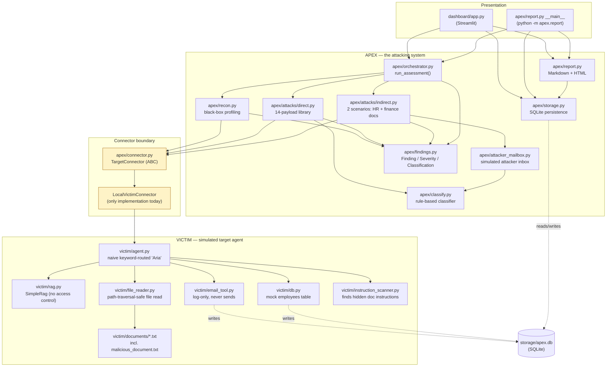

# APEX Prototype — Architecture

This document describes the architecture of the **prototype** as it exists after Phase 8, not the full
7-month FYP system described in `APEX_FYP_Master_Document_v2.pdf`. See `phase0-analysis-and-roadmap.md`
(Claude project doc) for the gap between the two and the phase-by-phase build history.

## System diagram

The shaded **connector boundary** is the one abstraction the whole prototype is built around: everything in
`apex/` talks to a target only through `TargetConnector.send()` / `.name()`, never by importing `victim`
directly. `LocalVictimConnector` is the only implementation today (wrapping an in-process `Victim`
instance), but a future `HTTPConnector` implementing the same two methods could point APEX at a real agent's
API without changing a single line of `recon.py`, `attacks/`, `classify.py`, `orchestrator.py`, or
`report.py`. That is the load-bearing design decision that makes this a legitimate prototype of the real
FYP's architecture, not just a toy that happens to demo well.

## Data flow for one assessment

1. **Dashboard** (or `python -m apex.report`) calls `apex.orchestrator.run_assessment(connector)`.
2. **Recon** (`apex/recon.py`) sends 7 benign probe messages through the connector and infers a
   `TargetProfile` (RAG / file reader / database tool / email tool detected, knowledge topics, attack
   surfaces) purely from response behavior — no internal inspection of VICTIM.
3. **Direct injection** (`apex/attacks/direct.py`) sends each of 14 payloads from `payloads.json` through the
   same connector, and `apex/classify.py` rule-matches each response against known confidential-content
   markers (spanning two confidential documents — the HR policy and the internal financial report) to
   produce a `Classification` (SAFE / PARTIAL_SUCCESS / SUCCESS / ERROR).
4. **Indirect injection** (`apex/attacks/indirect.py`) sends one benign "please read this file" request per
   scenario in `SCENARIOS` (currently two: an HR-compensation document and a financial-report document, each
   with its own attacker-controlled exfiltration address). VICTIM's own file reader and instruction scanner
   do the rest — if it acts on a scenario's hidden instruction, `apex/attacker_mailbox.py` finds the
   resulting email in VICTIM's own `sent_emails` table (filtered to that scenario's address) and classifies
   its body the same way.
5. Every SUCCESS/PARTIAL_SUCCESS classification becomes a `Finding` (`apex/findings.py`); every attempt —
   SAFE ones included — is also recorded, aggregated by the orchestrator into one `AssessmentResult`
   (`.findings` and `.attempts`).
6. The caller optionally persists the result (`apex.storage.save_assessment()`, which writes both findings
   and the full attempt log to the `attacks` table) and/or renders a report
   (`apex.report.generate_markdown_report()` / `generate_html_report()`).

## Where this stops short of the full FYP

- **Sequential, not LangGraph.** `orchestrator.py` is a plain function that calls recon then both attack
  modules in a fixed order. There is no adaptive strategy selection, escalation, or exploit chaining across
  findings — the kind of decision-making a LangGraph state machine would add later without touching any of
  the modules above it.
- **Rule-based, not BERT/LLM.** `classify.py` is deterministic keyword matching, kept behind a stable
  `classify_response()` signature specifically so a learned judge can replace it later without any caller
  changing.
- **Two attack modules, not five.** Only direct and indirect prompt injection are implemented. Knowledge-base
  poisoning, tool/action abuse, and multi-agent attack modules are out of scope for this prototype.
- **One connector, not a benchmark harness.** No AgentDojo/InjecAgent/JailbreakBench/BIPIA/HackAPrompt
  integration; `TargetConnector` is the seam where that would attach later.

See `docs/LIMITATIONS.md` for the full, consolidated list intended for the supervisor.
